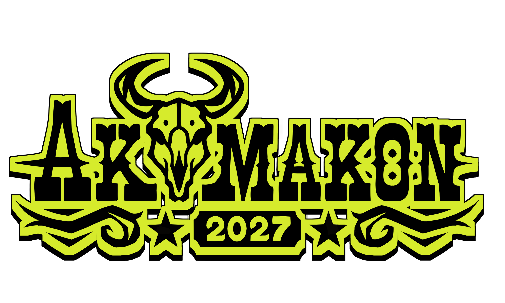

# Akumakon-Branding-2027
Branding for Akumakon 2027

Akumakon is a student-run, anime and japanese culture convention hosted annually by the University of Galway. It is one of the longest running anime conventions in Ireland. I am currently creating the branding and art for Akumakon 2027.

I'm creating a new mascot, logo, social media templates, posters, banners, stickers, keychains, etc. for the event.

All artworks drawn in Medibang Paint Pro without the use of generative AI. Adobe Illustrator used for vector artworks.

Official Instagram: https://www.instagram.com/akumakon?igsh=ajZyYTVsczg2ZjN1
